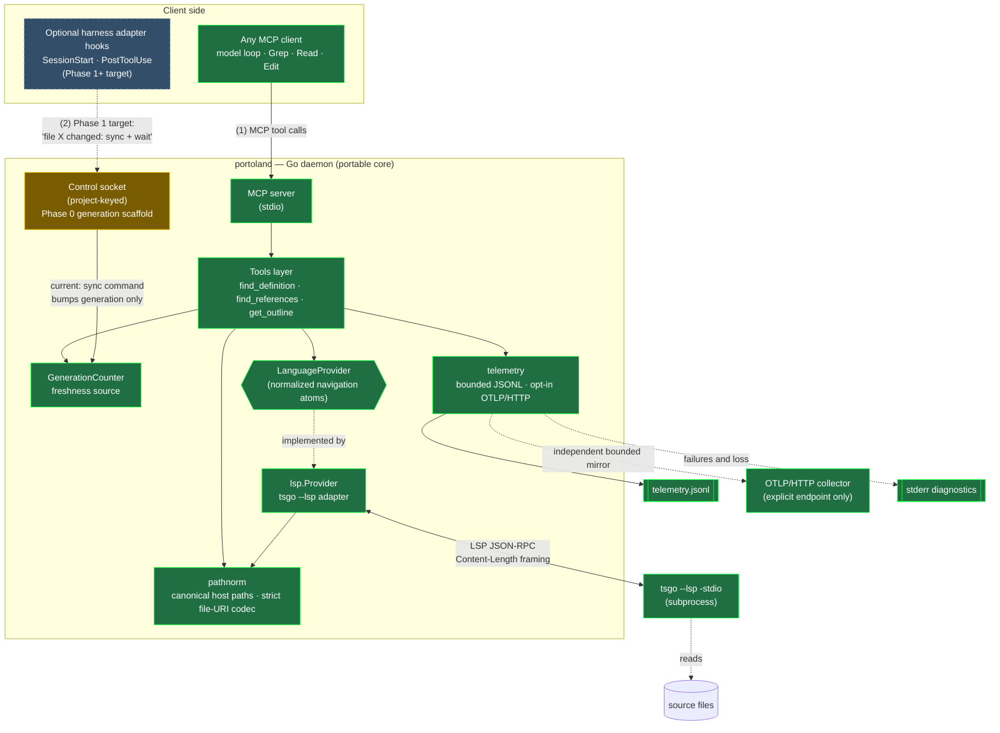
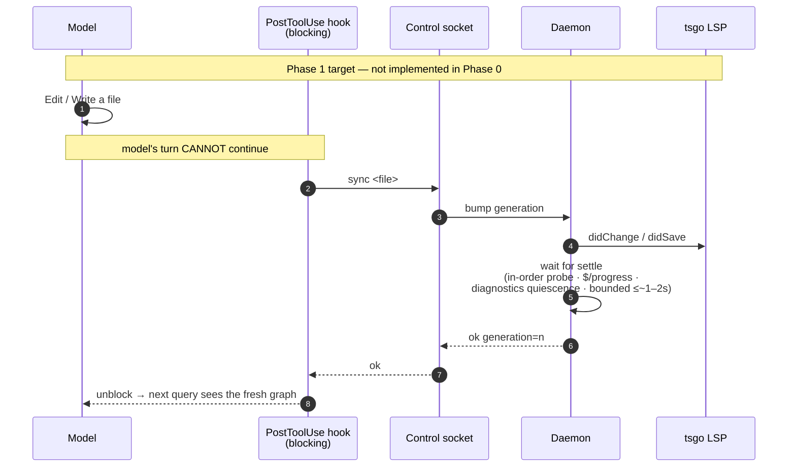
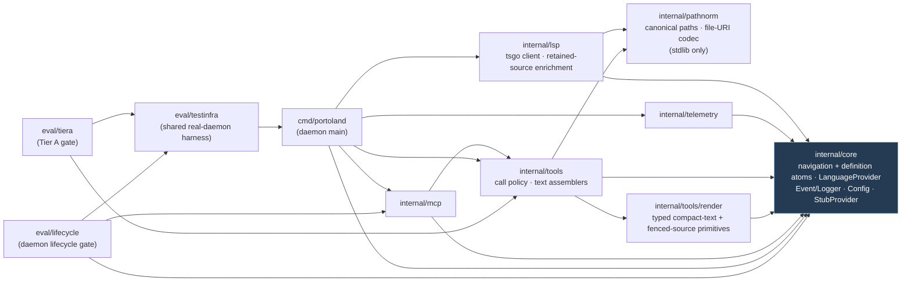
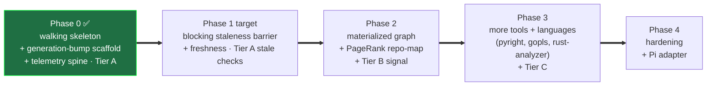
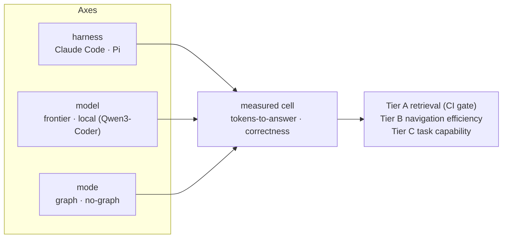

# Architecture

Visual companion to `PLAN.md` (the *how* and the *order*), `INTEGRATION_CONSTRAINTS.md`
(decisions), and `EVAL.md` (measurement). Diagrams are [Mermaid](https://mermaid.js.org/) and
render natively on GitHub.

**One sentence:** a long-lived **Go daemon** (`portoland`) exposes an LSP-derived code graph to a
coding agent through **two faces on one process** — MCP tools for the model, and a control socket
whose current generation-bump scaffold becomes the harness's blocking edit-sync barrier in Phase 1
— so the agent has a graph-aware tool alongside grep for accurately answering structural and
relational codebase questions.

---

## 1. System architecture

Two client faces share one process because *staleness forces it*: the edit-sync hook and the model
must see the same live LSP/graph state.



**Legend:** green = implemented in Phase 0 · amber = Phase 0 *scaffold* (the real socket accepts
`sync <file>` and bumps the shared generation only) · blue dashed = target behavior not yet
implemented. There is currently no blocking hook, LSP `didChange`/`didSave`, or settle detection.
Those land in Phase 1. The MCP face is harness-agnostic; harness-specific adapters are optional
integrations for lifecycle injection and edit synchronization, not a requirement for graph-tool
access. The materialized graph index (PageRank repo-map, blast-radius) is deliberately **not** here
yet — it enters at Phase 2.

**Control-socket lifecycle:** each daemon holds an advisory lock in a private per-user runtime
directory for the listener lifetime. Socket directories must be user-owned and non-writable by
other users; listeners publish with mode `0600`, authorize peer credentials, and replace only the
exact inode confirmed stale without overwriting a concurrent replacement. Shutdown closes the
listener first, marks shutdown under the connection mutex, closes every accepted connection
(including idle clients), and waits for handlers before removing only the socket inode this daemon
bound. The lock file remains in place so ownership release cannot race with path cleanup.

**Cross-cutting principles** (from `PLAN.md`): signatures-not-bodies · symbol-name-path addressing ·
cap/paginate every tool · never deny grep · bounded waits everywhere · accept honest null results.
`find_definition` is the deliberate source-bearing exception to the signatures-not-bodies default:
after the tools layer caps provider locations, `internal/lsp` matches each retained target exactly to
a canonical full symbol range and extracts that range from the same source snapshot retained by
`didOpen`. Grouped target-file work is bounded, while typed definitions and final text preserve
provider order and fail atomically rather than falling back to narrow locations or newer disk text.
For `get_outline`, `Signature` is a compact provider-authoritative semantic summary and `Detail`
preserves independent `DocumentSymbol.detail`. The tools layer caps the flattened outline before the
provider performs a concurrency-limited hover batch. Named TypeScript classes and interfaces use
complete canonical ranges to extract matched,
bodyless declaration headers with generics and `extends`/`implements` clauses; malformed, anonymous,
mismatched, or unavailable headers fall back atomically to hover. Other named symbols use their
selection ranges; synthetic TypeScript symbols use source ranges only to locate an authoritative
hover position, while bodyless call, construct, and index signatures use their complete declaration
ranges. Source-range planning uses the exact text retained from `didOpen`, so it cannot mix LSP
ranges with a newer disk snapshot before Phase 1 adds edit synchronization. If none of those sources
yields an authoritative summary, the optional signature is omitted rather than reconstructed from a
body.

---

## 2. A tool call, end to end

How `find_definition` resolves — note the name→position step (the "symbol-name-path addressing"
principle: the model names a symbol, the tool resolves it to an LSP position via the file outline,
because raw offsets shift under unobserved edits).

```mermaid
sequenceDiagram
    autonumber
    participant M as Model
    participant S as MCP server
    participant T as Tools layer
    participant P as lsp.Provider
    participant R as lsp.transport<br/>(write gate · lifecycle · reader)
    participant G as tsgo LSP
    participant L as Telemetry owner

    M->>S: tools/call find_definition {file, symbol}
    S->>T: FindDefinition(in)
    T->>T: snapshot Freshness once for output and Event
    T->>T: establish one 5s operation context
    T->>T: Canonicalize(file) — pathnorm (C:\… → /mnt/c/…)
    alt invalid or unrepresentable file
        T->>L: admit exactly one failure Event
        T-->>S: FindDefinitionOutput{error, freshness}
    else canonical file
        T->>P: DocumentSymbols(canonical file, operation context)
        opt first query for this file
            P->>P: read file under per-file open transition
            P->>R: dispatch textDocument/didOpen
            R->>G: textDocument/didOpen
        end
        P->>R: register + dispatch textDocument/documentSymbol
        R->>G: textDocument/documentSymbol
        G-->>R: symbol tree
        R-->>P: demultiplexed response
        P-->>T: []Symbol or provider/cancellation error
        alt symbol stage failure
            T->>L: admit exactly one failure Event
            T-->>S: FindDefinitionOutput{error, same freshness}
        else symbol stage succeeds
            T->>T: resolve name → Position (SelRange.Start)
            alt requested symbol is unresolved
                T->>L: admit exactly one honest-empty Event
                T-->>S: FindDefinitionOutput{empty, same freshness}
            else requested symbol resolves
                T->>P: Definition(canonical file, pos, same operation context)
                P->>R: register + dispatch textDocument/definition
                R->>G: textDocument/definition
                G-->>R: Location[]
                R-->>P: demultiplexed response
                P-->>T: []core.Location or provider/cancellation error
                alt definition stage failure
                    T->>L: admit exactly one failure Event
                    T-->>S: FindDefinitionOutput{error, same freshness}
                else provider returns no definition
                    T->>L: admit exactly one honest-empty Event
                    T-->>S: FindDefinitionOutput{empty, same freshness}
                else provider returns locations
                    T->>T: cap at Cfg.Cap()
                    T->>P: DefinitionSources(capped locations, same operation context)
                    par each distinct target file, at most 8 active
                        P->>P: DocumentSymbols(target) via prepareOpen
                        P->>R: textDocument/documentSymbol
                        R->>G: textDocument/documentSymbol
                        G-->>R: canonical target symbol tree
                        R-->>P: demultiplexed response
                        P->>P: exact target range → Symbol.Range<br/>slice retained didOpen source
                    end
                    P-->>T: []core.Definition in provider order<br/>or one atomic error
                    alt mapping, extraction, provider, or cancellation failure
                        T->>L: admit exactly one failure Event
                        T-->>S: FindDefinitionOutput{error, same freshness}
                    else complete enrichment
                        T->>L: admit exactly one success Event
                        T-->>S: FindDefinitionOutput{found, definitions, same freshness}
                    end
                end
            end
        end
    end
    S->>T: RenderDefinition(input, output)
    T-->>S: deterministic definition, empty, or error text
    S-->>M: one TextContent; no structured duplicate
    L-->>L: bounded FIFO → JSONL writer<br/>+ independent OTLP batch mirror
```

Telemetry admission snapshots each Event once before fan-out. JSONL is authoritative: one writer
owns a 512-record FIFO, waits at most 50 ms for capacity, preserves accepted-record order, and caps
serialized records at 16 KiB. Shutdown stops admission, drains, fsyncs, and closes within one shared
two-second lifecycle bound. OTLP/HTTP is enabled only by an explicit standard endpoint environment
variable and uses an independent bounded batch processor. Loss and sink failures are counted, joined
into shutdown errors, and diagnosed on stderr; MCP stdout remains protocol-only.

The **tools layer owns one fixed 5-second operation budget** for the complete invocation. The same
context covers path preparation, first-open disk reads and `didOpen`, name resolution, provider
requests, capped definition-source enrichment, outline signature enrichment, serialization, pipe
writes, and response waits; the provider does not reset the deadline between stages. One
tools-owned provider-stage runner invokes every
provider request and rejects an otherwise successful result if the operation context is canceled by
its acceptance point. Definition-source and outline-signature enrichment run only after their result
caps are applied and admit at most eight concurrent target-file or hover requests respectively.
Provider initialization keeps its separate 20-second budget for project loading.

The `lsp.Provider` is concurrency-safe and delegates JSON-RPC connection ownership to one
`transport`. That owner arbitrates open, closing, closed, and aborted states; pending-request
completion; write admission; stdin closure; process kill and reap; and repeated close or abort.
External requests, notifications, and `$/cancelRequest` writes are admitted only while open. The
shutdown request owns the transition to closing, server-request responses remain permitted while
open or closing until stdin closure begins, `exit` is permitted only while closing, and no frame is
admitted after stdin closure or in a terminal state.
Finite work without a cancellable underlying API—first-open file reads, JSON serialization, frame
preparation, and response conversion—runs through `runFiniteWork`. Its buffered completion channel
lets late work exit without retaining a canceled caller; caller cancellation takes precedence over
transport interruption, and either takes precedence over a completion visible at arbitration. The
frame writer remains a distinct mechanism because writes can partially reach the subprocess: its
atomic dispatch/abort state prevents a canceled frame from becoming dispatched and makes the
transport terminal after a blocked or partial write, rather than treating I/O as discardable finite
work.
One background reader goroutine demuxes responses into pending entries that accept exactly one
terminal response or error, so late responses are ignored. Per-file open transitions retain one
canonical `didOpen` while allowing unrelated files to read concurrently. A context-aware write gate
serializes complete frames; cancellation before dispatch writes nothing, cancellation that wins
after dispatch removes the pending request and schedules a bounded best-effort cancellation
notification, and cancellation during a blocked or partial frame aborts the transport. Server
requests such as `client/registerCapability` are answered asynchronously within a bounded
server-response budget, so they cannot stall response demultiplexing.

---

## 3. The staleness barrier (Phase 1 target — the hard core)

This sequence is the **target state, not current Phase 0 behavior**. In TS 7 *all* languages
(including TS) are analyzed out-of-process via LSP, so there is no in-process freshness freebie. The
barrier will make edits deterministically visible before the model's next turn. Phase 0 ships only
the socket + generation-bump plumbing; Phase 1 adds the hook, LSP edit notifications, blocking wait,
and settle detection.



Three-layer defense, deepest first: **(1)** the deterministic barrier above; **(2)** freshness
metadata — every result carries `generation` + `stale`; **(3)** a model-facing search-strategy doc
on how to react to `stale: true`. Never hang the model — bounded waits, then return with a tag.

---

## 4. Package dependency graph (Phase 0)

`internal/core` is the stable cross-package contract center, while `internal/pathnorm` owns shared
canonical host-path and file-URI identity. Provider and tool packages depend on those foundational
owners; the daemon and eval packages wire the implementations together.



The daemon wires the seam: `cmd/portoland` swaps the `StubProvider` for `lsp.New(cfg)` and the
`NopLogger` for `telemetry.FromConfig`. The telemetry owner always creates bounded JSONL and adds
OTLP/HTTP only when a standard OTLP endpoint is explicitly configured. The lifecycle gate derives
its expected default control-socket path through the same `internal/mcp` owner and follows that path
through real-daemon readiness, command handling, duplicate ownership, and shutdown cleanup.

### Normalized navigation ownership

The three current navigation tools depend only on `core.LanguageProvider` and its typed canonical
atoms. `internal/lsp` keeps JSON-RPC transport, operation orchestration, and concrete raw-result
conversion behind that seam; `internal/pathnorm` remains the sole path/file-URI identity owner.
`internal/tools/render` projects canonical positions, ranges, symbols, locations, and exact fenced
source into shared compact-text primitives without provider or MCP dependencies.
`tools.RenderOutline` and `tools.RenderDefinition` are the sole authors of their respective
agent-facing text, and
`internal/mcp` carries each text verbatim as the single content item of an untyped tool result, so no
formatter or escaping decision lives at the transport. `find_references` remains SDK-derived
structured JSON. `get_outline` caps the document-symbol
structure before requesting input-ordered signatures for retained symbols. `internal/lsp` completes
those canonical signatures: matched class/interface headers come from the retained `didOpen`
snapshot, while malformed or unavailable headers and other semantic summaries use hover. Rendering
consumes canonical results and never participates in normalization; selection ranges, provider
`Detail`, and the freshness stamp stay in the typed result for behavior, provider navigation,
telemetry, and tests rather than reaching routine agent-facing text. Definition targets likewise
remain typed navigation facts while only their canonical full ranges and exact sources reach
definition text. `Detail` consequently has no
current agent-facing consumer: it remains a normalized provider fact, not a second declaration
string for a renderer to fall back to.

[`PROVIDER_NORMALIZATION.md`](./PROVIDER_NORMALIZATION.md) is the canonical detailed contract for
this boundary, including its complete inventory, ownership table, current null/empty/malformed/error
and cancellation semantics, independent decoder coverage, bounded enrichment flow, and deferred
capability or server-adapter concerns.

---

## 5. Phase roadmap



**Phase 0 exit criteria — all green:** MCP round-trip works · every call logged (JSONL) · Tier A
retrieval-correctness green on a pinned TS repo (`eval/tiera`, which drives the *real* daemon over
MCP).

---

## Eval axis (context)

The whole thing exists to be measured. The eval design is `{harness} × {frontier | local} ×
{graph | no-graph}`, stratified by "navigation spread" — see `EVAL.md`. The `graph_mode` tag on
every telemetry Event is what makes the graph-on vs graph-off comparison sliceable.


