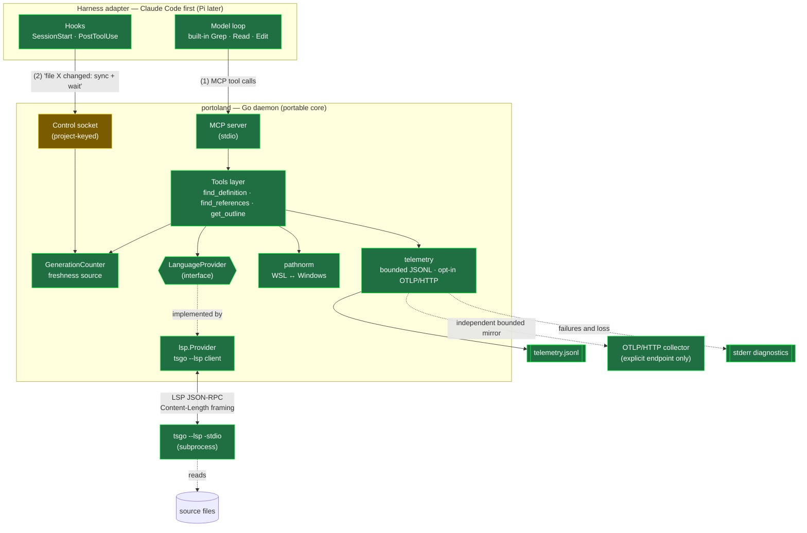
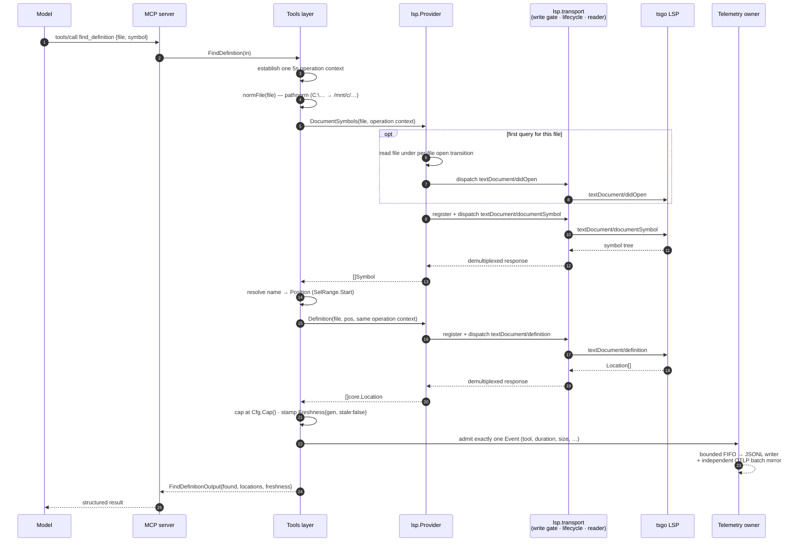
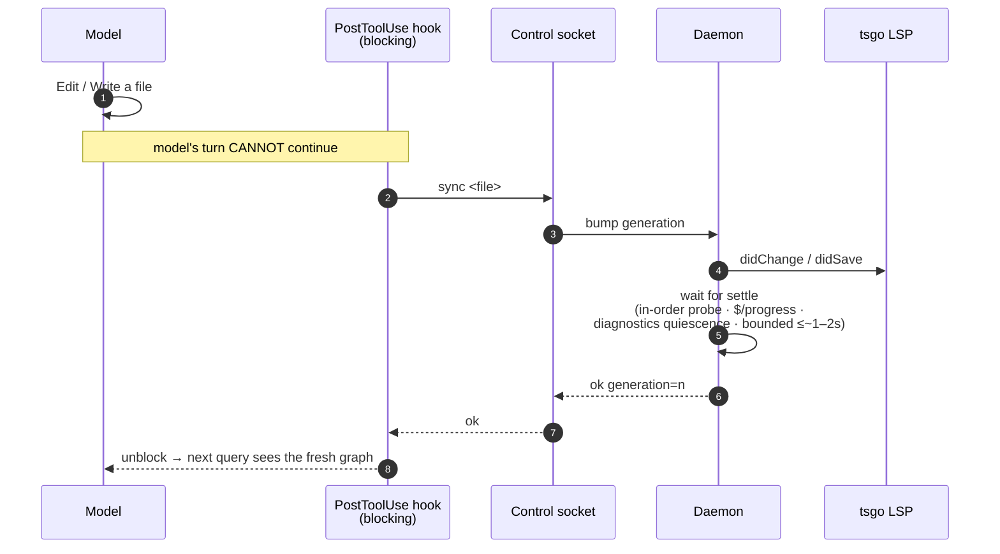
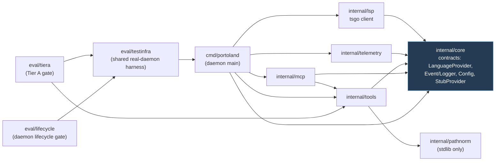
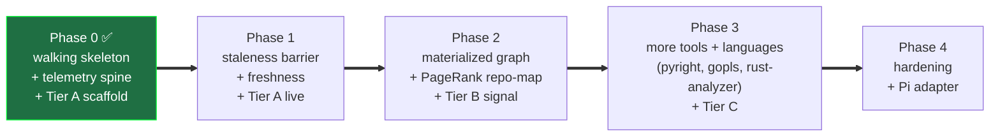
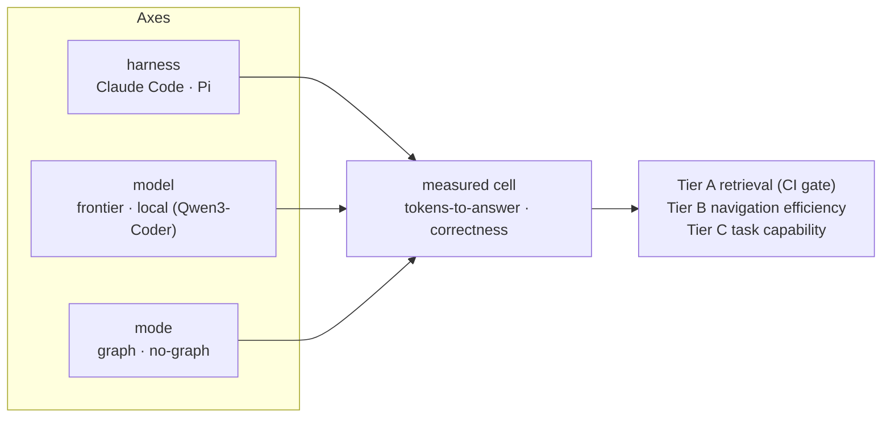

# Architecture

Visual companion to `PLAN.md` (the *how* and the *order*), `INTEGRATION_CONSTRAINTS.md`
(decisions), and `EVAL.md` (measurement). Diagrams are [Mermaid](https://mermaid.js.org/) and
render natively on GitHub.

**One sentence:** a long-lived **Go daemon** (`portoland`) exposes an always-fresh, LSP-derived
code graph to a coding agent through **two faces on one process** — MCP tools for the model, and a
control socket for the harness's edit-sync barrier — so the agent navigates code by typed graph
lookup instead of grep.

---

## 1. System architecture

Two client faces share one process because *staleness forces it*: the edit-sync hook and the model
must see the same live LSP/graph state.

**Legend:** green = implemented in Phase 0 · amber = Phase 0 *scaffold* (real socket + protocol, but
the blocking barrier logic lands in Phase 1). The materialized graph index (PageRank repo-map,
blast-radius) is deliberately **not** here yet — it enters at Phase 2.

**Control-socket lifecycle:** each daemon holds an advisory lock in a private per-user runtime
directory for the listener lifetime. Socket directories must be user-owned and non-writable by
other users; listeners publish with mode `0600`, authorize peer credentials, and replace only the
exact inode confirmed stale without overwriting a concurrent replacement. Shutdown closes the
listener first, marks shutdown under the connection mutex, closes every accepted connection
(including idle clients), and waits for handlers before removing only the socket inode this daemon
bound. The lock file remains in place so ownership release cannot race with path cleanup.

**Cross-cutting principles** (from `PLAN.md`): signatures-not-bodies · symbol-name-path addressing ·
cap/paginate every tool · never deny grep · bounded waits everywhere · accept honest null results.

---

## 2. A tool call, end to end

How `find_definition` resolves — note the name→position step (the "symbol-name-path addressing"
principle: the model names a symbol, the tool resolves it to an LSP position via the file outline,
because raw offsets shift under unobserved edits).

Telemetry admission snapshots each Event once before fan-out. JSONL is authoritative: one writer
owns a 512-record FIFO, waits at most 50 ms for capacity, preserves accepted-record order, and caps
serialized records at 16 KiB. Shutdown stops admission, drains, fsyncs, and closes within one shared
two-second lifecycle bound. OTLP/HTTP is enabled only by an explicit standard endpoint environment
variable and uses an independent bounded batch processor. Loss and sink failures are counted, joined
into shutdown errors, and diagnosed on stderr; MCP stdout remains protocol-only.

The **tools layer owns one fixed 5-second operation budget** for the complete invocation. The same
context covers path preparation, first-open disk reads and `didOpen`, name resolution, both provider
requests, serialization, pipe writes, and response waits; the provider does not reset the deadline
between stages. Provider initialization keeps its separate 20-second budget for project loading.

The `lsp.Provider` is concurrency-safe and delegates JSON-RPC connection ownership to one
`transport`. That owner arbitrates open, closing, closed, and aborted states; pending-request
completion; write admission; stdin closure; process kill and reap; and repeated close or abort.
External requests, notifications, and `$/cancelRequest` writes are admitted only while open. The
shutdown request owns the transition to closing, server-request responses remain permitted while
open or closing until stdin closure begins, `exit` is permitted only while closing, and no frame is
admitted after stdin closure or in a terminal state.
One background reader goroutine demuxes responses into pending entries that accept exactly one
terminal response or error, so late responses are ignored. Per-file open transitions retain one
canonical `didOpen` while allowing unrelated files to read concurrently. A context-aware write gate
serializes complete frames; cancellation before dispatch writes nothing, cancellation that wins
after dispatch removes the pending request and schedules a bounded best-effort cancellation
notification, and cancellation during a blocked or partial frame aborts the transport. Server
requests such as `client/registerCapability` are answered asynchronously within a bounded
server-response budget, so they cannot stall response demultiplexing.

---

## 3. The staleness barrier (Phase 1 — the hard core)

In TS 7 *all* languages (including TS) are analyzed out-of-process via LSP, so there is no
in-process freshness freebie. The barrier makes edits deterministically visible before the model's
next turn. Phase 0 ships the socket + generation plumbing; Phase 1 makes `PostToolUse` **blocking**
and adds settle detection.

Three-layer defense, deepest first: **(1)** the deterministic barrier above; **(2)** freshness
metadata — every result carries `generation` + `stale`; **(3)** a model-facing search-strategy doc
on how to react to `stale: true`. Never hang the model — bounded waits, then return with a tag.

---

## 4. Package dependency graph (Phase 0)

`internal/core` is the frozen center; everything depends inward on it and nothing on each other
(except the daemon and eval, which wire the pieces together). This is exactly what let the four
implementation packages be built in parallel.

The daemon wires the seam: `cmd/portoland` swaps the `StubProvider` for `lsp.New(cfg)` and the
`NopLogger` for `telemetry.FromConfig`. The telemetry owner always creates bounded JSONL and adds
OTLP/HTTP only when a standard OTLP endpoint is explicitly configured.

---

## 5. Phase roadmap

**Phase 0 exit criteria — all green:** MCP round-trip works · every call logged (JSONL) · Tier A
retrieval-correctness green on a pinned TS repo (`eval/tiera`, which drives the *real* daemon over
MCP).

---

## Eval axis (context)

The whole thing exists to be measured. The eval design is `{harness} × {frontier | local} ×
{graph | no-graph}`, stratified by "navigation spread" — see `EVAL.md`. The `graph_mode` tag on
every telemetry Event is what makes the graph-on vs graph-off comparison sliceable.

